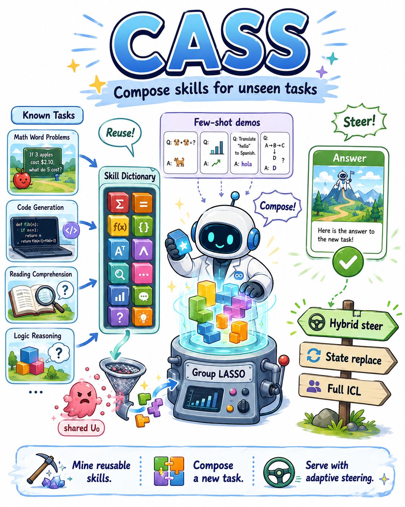
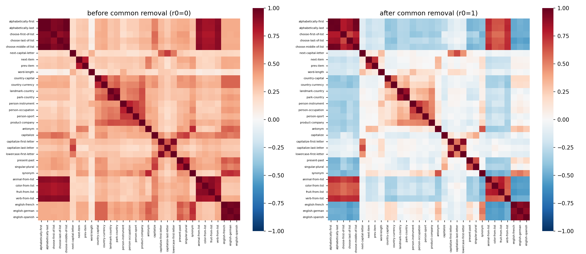
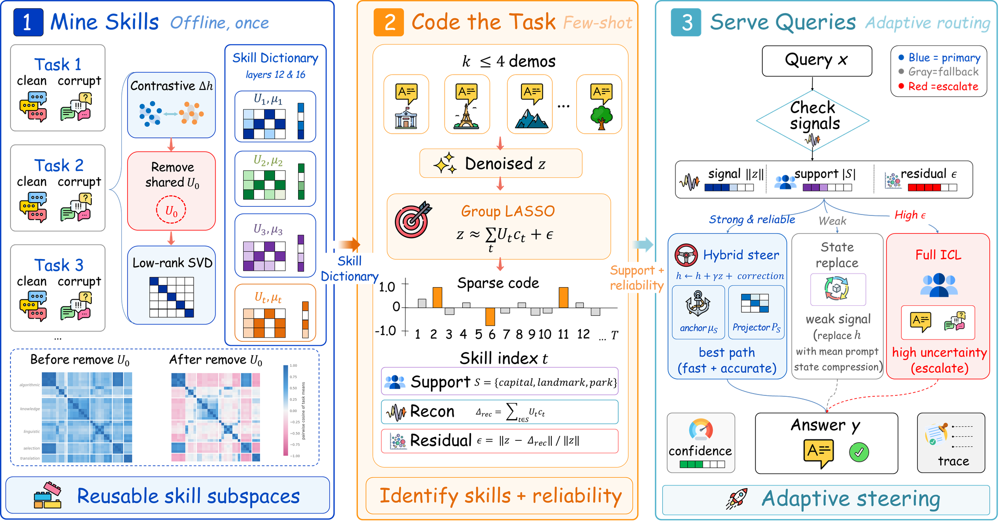
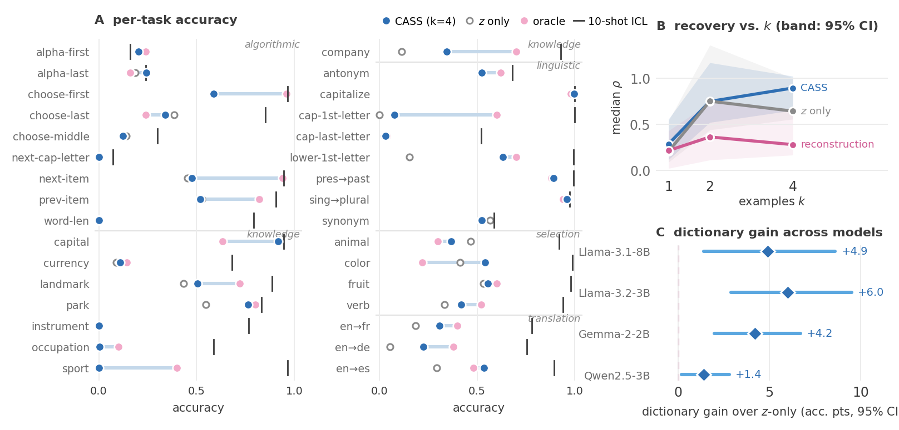
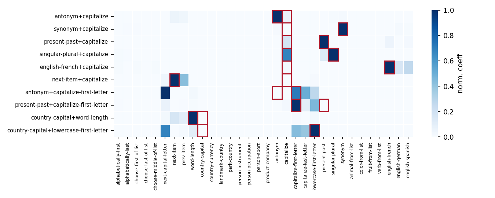
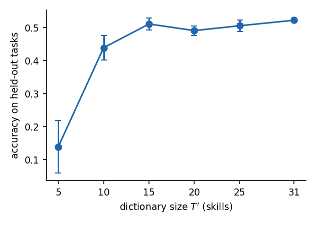
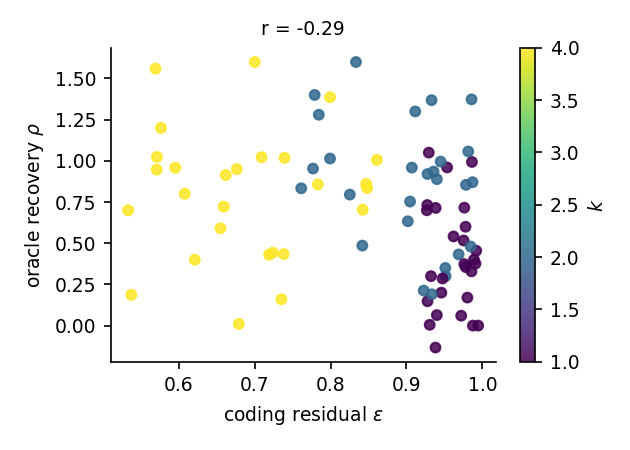

<p align="center">
  
</p>

# CASS: Compositional Adaptive Subspace Steering

**Training-free adaptation to unseen tasks by mining and composing skill
subspaces from LLM activations.**

Few-shot prompting pays for the same demonstrations on every query. CASS
pays once: it distills what a model's activations already know about
previously seen tasks into a reusable *skill dictionary*, and serves a
brand-new task — arriving with as few as 4 examples — with **zero
in-context tokens**, at a fraction of ICL's serving cost.

---

## Motivation

Production LLM workloads are dominated by many small, recurring tasks —
field normalization, label translation, entity-to-attribute mapping —
each specified by a handful of examples and issued thousands of times.
Prepending demonstrations is effective but expensive: a 10-shot prompt
multiplies per-query tokens by an order of magnitude, and that cost is
paid again on every call.

Activation steering offers a way out: a *task vector* distilled from
demonstrations, injected into the residual stream, triggers the task with
no demonstrations in context (Hendel et al. 2023; Todd et al. 2024). But
existing vector libraries only serve tasks they have already stored. The
case that dominates the long tail — an **unseen** task with a k≤4 example
budget — has no answer.

The obvious training-free move is to compose: approximate the new task's
vector from stored ones. **It does not work.** Averaging dictionary
vectors recovers *zero percent* of oracle steering performance on our
benchmark. Our diagnosis: every contrastively extracted task vector
shares a large **task-generic component** — the signature of "an
in-context task is being executed", independent of which one. Under
addition the shared parts compound while the task-specific parts dilute.

Projecting out this single shared direction ($U_0$, rank 1):

- drops the median cosine between task means from 0.34 to 0.18,
- exposes a family-block geometry that was invisible before,
- lifts downstream composition accuracy from **0.32 to 0.54** —
  while removing a *random* direction of the same rank does nothing (0.33).

<p align="center">
  
</p>

What remains is only *partially* compositional: a held-out task is well
approximated inside the span of a few related skills (currency lands on
{capital, landmark, park}, French on {German, Spanish}), but an
irreducible task-specific remainder lies outside every other task's
subspace, and steering fails without it. CASS is built around exactly
this division of labor.

## Method

<p align="center">
  
</p>

**1 — Mine skills (offline, once).** For each known task, contrast clean
10-shot prompts against label-deranged twins and record differential
activations at every layer in one forward pass. Remove the shared
task-generic component $U_0$ (rank-1 SVD of stacked task means) and store
each skill as a low-rank subspace $U_t$ with anchor $\mu_t$ at two
residual-stream depths (layers $\{12,16\}$ of 32).

**2 — Code the task (few-shot).** Distill the $k\le4$ demonstrations into a
denoised direction $z$ (6 resampled prompt pairs per example,
leave-self-out shots), then solve a **group LASSO** whose support is
shared across layers:

$$z \;\approx\; \sum_{t\in S} U_t\, c_t \;+\; \varepsilon \qquad\text{(support } S\text{, code } c\text{, residual } \varepsilon\text{)}$$

Block coordinate descent with exact group soft-thresholding; a
support-capped $\lambda$-path ($s_{\max}=5$) replaces cross-validation. The
sparse code doubles as an interpretable statement of *which known skills
the new task is made of*, and $\varepsilon$ doubles as a reliability signal.

**3 — Serve queries (adaptive routing).** The extraction signals pick the
path per task:

| signal | route |
|---|---|
| strong, reliable $\lVert z\rVert$ | **hybrid steering**: $h \leftarrow h + \tilde\alpha\gamma\, z + g\,\alpha\, P_S(\mu_S - h)$ — the demonstration direction plus a trust-gated correction toward the recovered subspace |
| weak $\lVert z\rVert$ ($< 0.9\times$ median anchor norm) | **prompt-state replacement** (compression; Hendel-style) |
| high residual $\varepsilon$ | **escalate to full ICL** |

Queries then run with zero context. Two propositions (support recovery
under block-coherence, error transfer) delineate where composition is
reliable, and their preconditions are *measured*, not assumed.

## Main results

Llama-3.1-8B-Instruct, strict exact-match, 3 seeds. Full tables in the paper.

| method (k=4) | LOTO-32 acc | median ρ | Novel-15 acc | Compound-10 acc |
|---|---|---|---|---|
| naive anchor averaging | 0.06 | 0.00 | 0.05 | 0.05 |
| retrieval (nearest skill) | 0.20 | 0.18 | 0.17 | 0.03 |
| ICV-style top-PC | 0.33 | 0.61 | 0.25 | — |
| z-only additive | 0.34 | 0.64 | 0.30 | — |
| task-vector replacement (Hendel) | 0.39 | 0.60 | 0.47 | 0.23 |
| CASS (composition only) | 0.39 | 0.85 | 0.37 | 0.16 |
| **CASS (full, routed)** | **0.46** | **0.87** | **0.50** | **0.29** |
| learned-Δ (40 grad steps, gradient reference) | 0.50 | 0.90 | 0.52 | 0.30 |
| 4-shot ICL (same examples, 4× tokens) | 0.72 | — | 0.85 | — |

ρ = recovery of the (ICL − zero-shot) gap. Highlights:

- **85%** of the 27 steerable held-out tasks exceed ρ = 0.6; the
  dictionary beats the demonstration vector alone by **+5.5 pts** pooled
  across 47 tasks (p = 2×10⁻⁴).
- **Interpretable composition**: on 10 compound tasks the top-weighted
  skill is a true constituent **9/10** times; supports are 61%
  same-family (random: 17%); inverse tasks select exactly their forward
  counterparts' subspaces.
- **Reliability signals for free**: ‖z‖ flags unsteerable tasks at AUC
  0.93; oracle recovery falls 0.87 / 0.74 / 0.51 across ε terciles, so ε
  prices the ICL fallback.
- **Cross-model**: transfers with only a layer-pair search to Llama-3.2-3B
  (+6.0 pts, p<10⁻⁴) and Gemma-2-2B (+4.2, p<10⁻⁴); the Qwen family is
  not steerable by this primitive (reported as a limitation, localized to
  the injection stage).
- **Serving cost**: hooks add 0% latency; 10-shot ICL is 2.6× slower
  wall-clock. Token break-even at ~17 queries, **10.2× cheaper** at 1k
  queries per task.

<p align="center">
  
</p>

<p align="center">
  
</p>

<p align="center">
  
  
</p>

*Left: held-out accuracy grows with dictionary size — each mined skill
makes every future unseen task easier. Right: the coding residual ε
predicts steering quality.*

## Reproducing

**Setup.** Python 3.10, PyTorch 2.8, transformers 4.57; one RTX 3090
(24 GB) suffices. Model weights are loaded locally
(paths in `src/cass/config.py`, `HF_HUB_OFFLINE=1`): Llama-3.1-8B-Instruct
(main), Llama-3.2-3B, Gemma-2-2B, Qwen3-4B, Qwen2.5-3B (cross-model).
Task data comes from the Todd et al. `function_vectors` repo in
`third_party/`. A `.env` with an OpenAI-compatible endpoint is needed
**only** for dataset synthesis (step 07) and failure judging (step 17) —
the method itself never calls an API.

**Run the pipeline.** The `scripts/` directory is a linear pipeline
`01`–`17`; each step reads the previous steps' outputs from
`results/<model>/`. Every experiment checkpoints and resumes safely, so
re-running a finished step is a no-op, and steps within a phase are
independent. Multi-stage scripts take a comma-separated stage argument
(`all` runs every stage).

<b>Phase 1 — Setup & mining.</b> Extract activations, freeze the injection
hyperparameters, and build the dictionary.

```bash
python scripts/01_extract_and_baselines.py llama31-8b     # activations + ZS/ICL baselines
python scripts/02_injection_setup.py       llama31-8b all # steerability scan + freeze hparams
python scripts/03_build_dictionary.py      llama31-8b     # dictionary + H1 diagnostics
```

<b>Phase 2 — Core experiments.</b> The results behind the tables and
figures.

```bash
CASS_KS=1,2,4 python scripts/04_e1_loto.py     llama31-8b     # E1: leave-one-task-out
python scripts/05_analyze_e1.py                llama31-8b     # per-task recovery table
python scripts/06_e2_compound.py               llama31-8b     # E2: compound tasks
python scripts/07_synthesize_tasks.py                         # novel tasks via API (data only)
python scripts/08_e7_novel.py                  llama31-8b     # novel suite, frozen dictionary
CASS_REP=all python scripts/09_e4_ablations.py llama31-8b all # ablation matrix (Table 2)
python scripts/10_e5_scale.py                  llama31-8b     # dictionary-size scaling
```

<b>Phase 3 — Baselines, attribution & routing.</b> Competing methods, the
RQ2 attribution studies, and the serving policy.

```bash
python scripts/11_baselines.py    all   # Hendel/ICV/retrieval/blend/ICL4 + novel & compound cells
python scripts/12_attribution.py  all   # RQ2 controls: denoise, random-dir, hparams, gate, learned-Δ
python scripts/13_router.py             # signal-aware routing (headline numbers; no GPU)
```

<b>Phase 4 — Analysis, figures & tables.</b> Regenerates every number,
figure, and LaTeX table from the checkpointed results (CPU-only apart from
the failure/latency probes).

```bash
python scripts/14_failure_analysis.py llama31-8b all   # LLM-judge taxonomy + contains metric
python scripts/15_cost_latency.py     llama31-8b all   # token cost + latency benchmark
python scripts/16_paper_figures.py                     # all figures (PNG)
python scripts/17_table2.py                            # Table 2 LaTeX from CSVs
```

Every number in the paper regenerates from the checkpointed CSVs and
stored generations (`results/*/**.jsonl`, enabling offline re-scoring under
any matcher) — Phase 4 needs no GPU. The full study used ~55 GPU-hours;
the largest single run (E1 over 32 tasks, all modes) takes under two hours.
See the table below for what each step produces.

| step | script | stages | output |
|---|---|---|---|
| 01 | `extract_and_baselines` | — | contrastive activations, ZS/10-shot ICL baselines |
| 02 | `injection_setup` | `scan` · `pair` | layer×γ steerability scan; frozen `injection_hparams.json` |
| 03 | `build_dictionary` | — | dictionary + H1 diagnostics (cosine matrices, μ_B) |
| 04 | `e1_loto` | — | E1 leave-one-task-out (`CASS_KS`, `CASS_SEEDS` env) |
| 05 | `analyze_e1` | — | `e1_summary.csv` (recovery ρ per task) |
| 06 | `e2_compound` | — | E2 compound tasks (case-sensitive) |
| 07 | `synthesize_tasks` | — | novel task datasets via API |
| 08 | `e7_novel` | — | novel-suite evaluation (frozen dictionary) |
| 09 | `e4_ablations` | axes · `all` | ablation matrix (`CASS_REP=all` → all-32 replication) |
| 10 | `e5_scale` | — | dictionary-size scaling |
| 11 | `baselines` | `lit` · `blend32` · `icl4` · `hendel_c` · `gaps` | Hendel replace, ICV, retrieval, blend, 4-shot ICL, and the novel/compound Table-1 cells (recon, zvec, learned-Δ, oracle) |
| 12 | `attribution` | `denoise` · `control` · `hparam` · `variants` · `learned` · `soft` | RQ2 controls: denoise vs dictionary, random-direction specificity, hparam sensitivity, signed gate, prefill-only, learned-Δ, soft-vs-hard routing |
| 13 | `router` | — | signal-aware routing, CASS full numbers (post-processing, no GPU) |
| 14 | `failure_analysis` | `judge` · `contains` | LLM-judge taxonomy, contains-vs-exact metric |
| 15 | `cost_latency` | `tokens` · `latency` | token cost table, latency micro-benchmark |
| 16 | `paper_figures` | — | all paper figures (PNG) |
| 17 | `table2` | — | Table 2 LaTeX from ablation CSVs |

## Layout

```
src/cass/    library: tasks, models (hooked LM), extract, dictionary,
             solver (group LASSO), steer, pipeline, compound, zcache,
             evaluate, api
scripts/     numbered pipeline 01–17 (above)
results/     per-model CSVs, JSON, stored generations (jsonl)
figures/     generated figures (PNG)
assets/      README images
third_party/ Todd et al. function_vectors task data
```

## Limitations

Short-form transformations with exact-match scoring; steerability of the
injection primitive is a model-family property (Qwen sits outside it —
run the one-time layer scan of step 02 before deploying); the layer pair
and three scalars are calibrated once per family; absolute accuracy
trails prompting — CASS is a cost–quality tier beneath ICL, with the
ε-fallback managing the gap.
